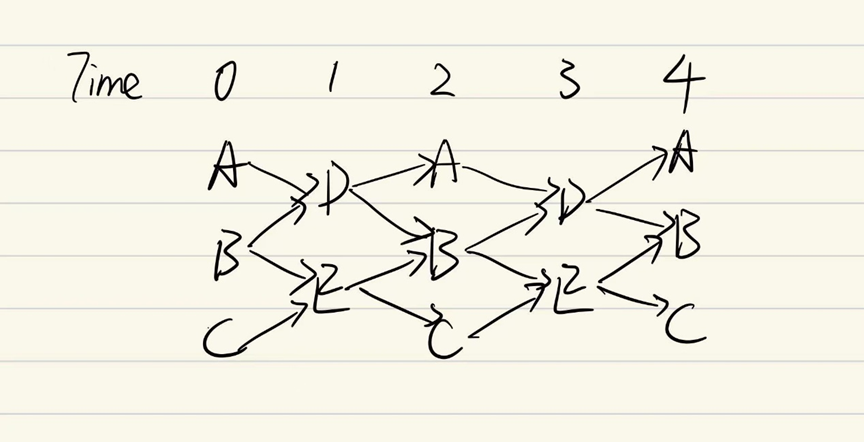
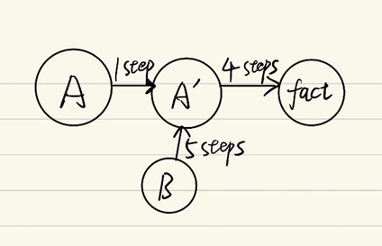
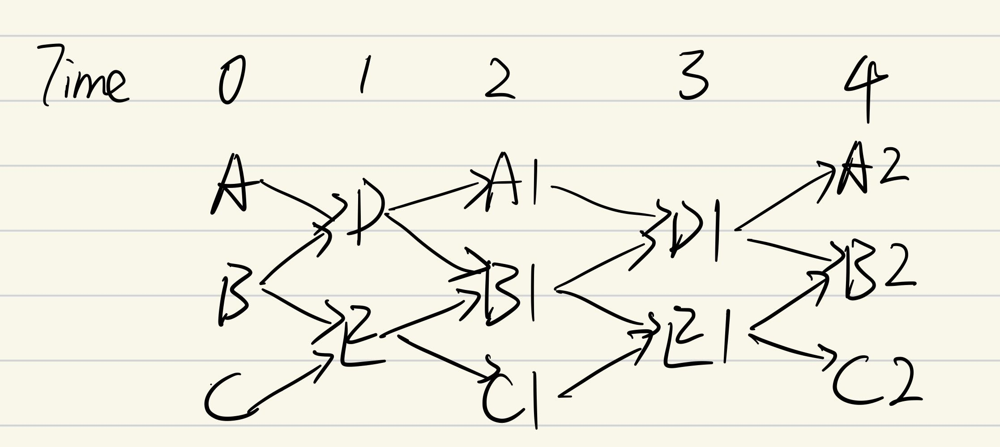
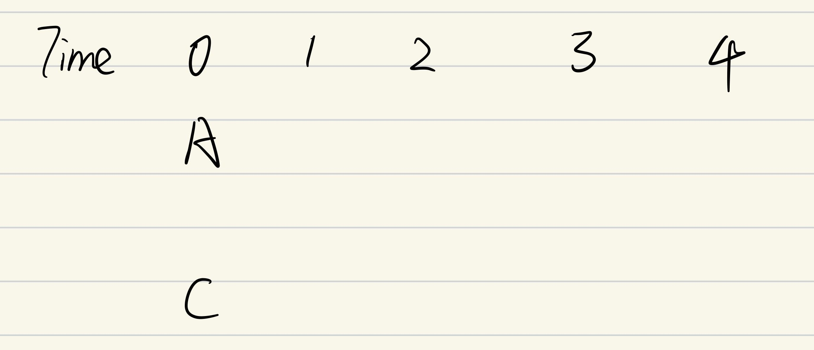
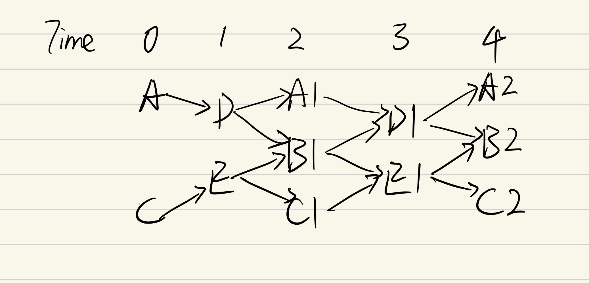
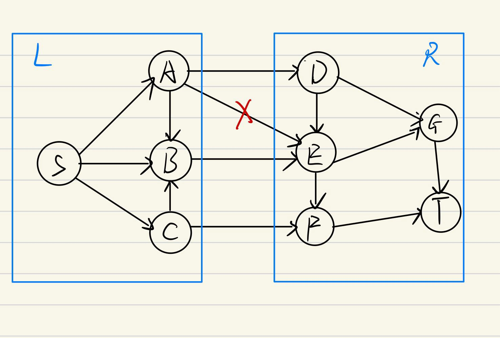

## Content

* <a href='#DonateBlood'>1. Donate_Blood</a>
* <a href='#Catastrophic_Delete'>2. Catastrophic_Delete</a>
* <a href='#Period_Change_1'>3. Period_Change_1</a>
* <a href='#Period_Change_2'>4. Period_Change_2</a>
* <a href='#Worst_DRed'>5. Worst_DRed</a>
* <a href='#Period_Zero'>6. Period_Zero</a>
* <a href='#Catastrophic_Delete_Datalog'>7. Catastrophic_Delete_Datalog</a>
* <a href='#Parent_Ancestor'>8. Parent_Ancestor</a>
* <a href='#Access_in_Graph'>9. Access_in_Graph</a>

***

#### 1. Donate_Blood

    data = [
        "Donated(a)@-365",
        "Vaccinated(a)@-20",
        "Ill(a)@[-10,-5]",

        "Vaccinated(b)@-250",
        "Vaccinated(b)@-170",
        "Vaccinated(b)@-130",
        "Vaccinated(b)@-90",
        "Vaccinated(b)@-55",
        "Vaccinated(b)@-20",
        "Ill(b)@[-200,-180]",
        "Ill(b)@[-130,-105]",
        "Ill(b)@[-80,-60]",
        "Ill(b)@[-30,-5]",
    ]
    program = [
               "NoDonate(X):-SOMETIME[-182,0]Donated(X)",
                "NoDonate(X):-SOMETIME[-30,0]Vaccinated(X)",
                "NoDonate(X):-Ill(X)@0",
    ]
    fact = "NoDonate(a)@0"
可以对b添加任意条件以增加运算量，不影响最终结果

#### 2. Catastrophic_Delete

    data = [
        "A(x)@0",
        "B(x)@0",
        "C(x)@0",

        "PeriodTen(x)@0"
    ]
    program = [
        "D(X):-ALWAYS[-1,-1] A(X)",
        "D(X):-ALWAYS[-1,-1] B(X)",
        "E(X):-ALWAYS[-1,-1] B(X)",
        "E(X):-ALWAYS[-1,-1] C(X)",
    
        "A(X):-ALWAYS[-1,-1] D(X)",
        "B(X):-ALWAYS[-1,-1] D(X)",
        "B(X):-ALWAYS[-1,-1] E(X)",
        "C(X):-ALWAYS[-1,-1] E(X)",

        "PeriodTen(X):-ALWAYS[-10,-10] PeriodTen(X)",
    ]
    fact = "A(x)@200"
示意图：

去除data中的"B(x)@0"，不会影响执行结果，但是Dred会删除Time>=1的所有fact，然后再重新推出fact。

#### 3. Period_Change_1

    data = [
        "Step_five(a)@[0,1]",
        "Step_seven(a)@[0,1]",
    ]
    program = ["ALWAYS[0,1] Step_five(X):- ALWAYS[-5,-4] Step_five(X)",
                "ALWAYS[0,1] Step_seven(X):- ALWAYS[-7,-6] Step_seven(X)"
    ]
    fact = "Step_five(a)@35"
去除Step_seven(a)@[0,1]可使周期长度由35改变到5；

#### 4. Period_Change_2

    data = [
        "Step_three(a)@0",
        "Step_three(a)@1",
        "Step_three(a)@2",
    ]
    program = ["Step_three(X):- ALWAYS[-3,-3]Step_three(X)"]
    fact = "Step_five(a)@5"
去除Step_three(a)@2可使周期长度由1改变到3；

#### 5. Worst_DRed

    data = [
        "Step_five(a)@0",#A
        "Step_oneA(a)@0",#B
        #"Step_fifty(b)@0"
    ]
    program = ["Step_five(X):- ALWAYS[-5,-5]Step_five(X)",
               "Step_oneB(X):- ALWAYS[-1,-1]Step_oneA(X)",
               "Step_oneC(X):- ALWAYS[-1,-1]Step_oneB(X)",
               "Step_oneD(X):- ALWAYS[-1,-1]Step_oneC(X)",
               "Step_oneE(X):- ALWAYS[-1,-1]Step_oneD(X)",
               "Step_one(X):- ALWAYS[-1,-1]Step_oneE(X)",
               #"Step_fifty(X):- ALWAYS[-50,-50]Step_fifty(X)"
    ]
    fact = "Step_five(a)@25"

示意图：

在单个周期内，若给出A、B两个数据，则可在5步内推出所有事实；但去掉事实A后，首先要花费5步回溯，再花费4步重新推出事实；对结果无影响。

data和program中关于Step_fifty的代码本意为设置周期长度足够大，但加入会导致程序不终止（挠头

#### 6. Period_Zero

    data = [
        "A(a)@0",
        "A(b)@-100"
    ]
    program = ["A(X):- SOMETIME[-10,-9]A(X)"]
    fact = "A(a)@200"

可用于观察MeTeoR的事实存储结构、研究Period性质。当时间足够大时，事件一直发生，Period为1

#### 7. Catastrophic_Delete_Datalog

    data = [
        "A(x)@0",
        "B(x)@0",
        "C(x)@0",
    ]
    program = [
               "D(X):-ALWAYS[-1,-1] A(X)",
                "D(X):-ALWAYS[-1,-1] B(X)",
                "E(X):-ALWAYS[-1,-1] B(X)",
                "E(X):-ALWAYS[-1,-1] C(X)",
    
                "A1(X):-ALWAYS[-1,-1] D(X)",
                "B1(X):-ALWAYS[-1,-1] D(X)",
                "B1(X):-ALWAYS[-1,-1] E(X)",
                "C1(X):-ALWAYS[-1,-1] E(X)",
    
                "D1(X):-ALWAYS[-1,-1] A1(X)",
                "D1(X):-ALWAYS[-1,-1] B1(X)",
                "E1(X):-ALWAYS[-1,-1] B1(X)",
                "E1(X):-ALWAYS[-1,-1] C1(X)",
    
                "A2(X):-ALWAYS[-1,-1] D1(X)",
                "B2(X):-ALWAYS[-1,-1] D1(X)",
                "B2(X):-ALWAYS[-1,-1] E1(X)",
                "C2(X):-ALWAYS[-1,-1] E1(X)",
               ]
    fact = "C2(x)@4"
Catastrophic_Delete的非递归版本，删除B(x)@0可触发灾难性的删除

Original:

OverDelete:

Redo:

#### 8. Parent_Ancestor

    data = [
        "parent(alice, bob)@0",
        "parent(bob, carol)@0",
        "parent(carol, david)@0",
        "parent(david,ella)@0",
        "parent(ella, frank)@0",
        "parent(frank, gloria)@0",
    ]
    program = [
            "ancestor(X, Y) :- parent(X, Y)",
            "ancestor(X, Y) :- parent(X, Z), ancestor(Z, Y)"
            ]
    fact = "ancestor(alice,gloria)@0"

Datalog的经典递归示例，定义了如何通过父母关系推导出祖先关系

#### 9. Access_in_Graph
    data = [
        "edge(s,a)@0",
        "edge(s,b)@0",
        "edge(s,c)@0",
    
        "edge(a,b)@0",
        "edge(c,b)@0",
    
        "edge(a,d)@0",
        "edge(a,e)@0",#delete this one
        "edge(b,e)@0",
        "edge(c,f)@0"
    
        "edge(d,e)@0",
        "edge(e,f)@0",
    
        "edge(d,g)@0",
        "edge(e,g)@0",
        "edge(g,t)@0",
        "edge(f,t)@0",
    ]
    program = [
            "path(X, Y) :- edge(X, Y)",
            "path(X, Y) :- path(X, Z), path(Z, Y)",
            #for undirect graph
            #"path(Y,X):- path(X, Y)"
            ]
    fact = "path(s,t)@0"

示意图：

结果分为三部分{path(x,y)|x,y∈{L}},{path(x,y)|x,y∈{R}},{path(x,y)|x∈{L},y∈{R}}.删除"edge(a,e)@0"会导致第三个部分中的部分事实被overdelete，然后重新被推出。

